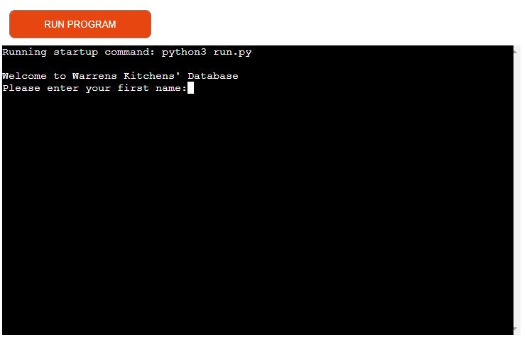
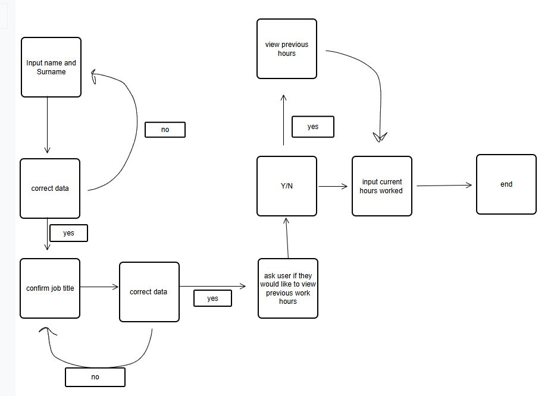
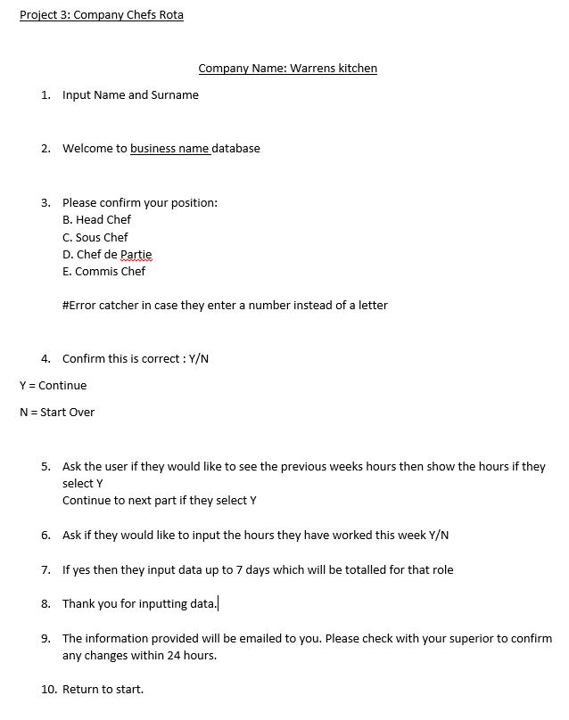
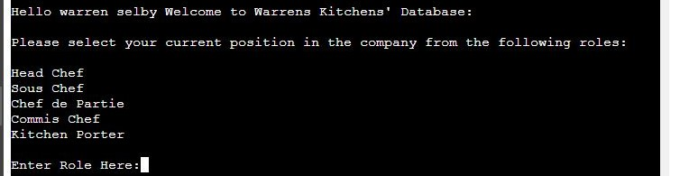
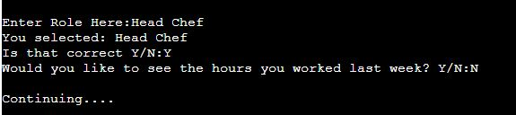
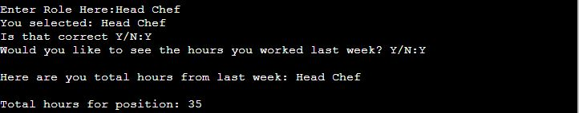
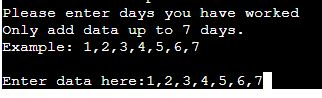
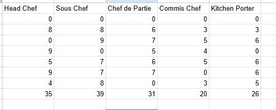
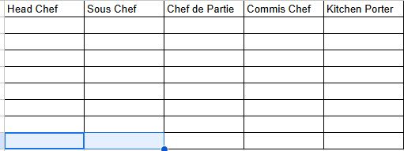

# Corri Construction Company - Contractor Page

The deployed project live link is [HERE](https://project-3-heroku-8742cd432e6c.herokuapp.com/) - **_Use Ctrl (Cmd) and click to open in a new window._**

## Contents

- [Introduction](#introduction)
- [Project](#project)
  - [User goals:](#user-goals)
  - [Site owner goals](#site-owner-goals)
- [Pre development](#pre-development)
- [Development](#development)
- [Features](#features)
  - [Name and profession input](#name-and-profession-input)
  - [Working days in a week](#working-days-in-a-week)
  - [Confirm information so far](#confirm-information-so-far)
  - [Confirmation of information](#confirmation-of-information)
  - [What the portal checks](#what-the-portal-checks)
  - [Error Page](#error-page)
- [Google Sheets](#google-sheets)
- [Technologies Used](#technologies-used)
- [Resources](#resources)
  - [Libraries](#libraries)
- [Testing](#testing)
- [Future Updates](#future-updates)
- [Validation](#validation)
- [Deployment](#deployment)
- [Heroku](#heroku)
- [Bugs](#bugs)
- [Credits](#credits)
- [Acknowledgements](#acknowledgements)

## Introduction

This portal asks employees of the company whether or not they would like to record their hours that they have worked in a week down into a system so as to allow them too keep on track with how much they're working in case they need to sort wages and such out with their managers. Working in a kitchen myself I knew first hand how hard it was to keep track of everything considering how busy everything is in that kind of work so I wanted to make something that could potentially make the lives of chefs less stressful.

## Project

The aim of this project is to:
-Reduce the amount of time people could spend searching for whether or not their pay checks are correct.
-Increase productivity in the workplace
-Encourage workers to speak up about their wages if they see any issues.

### User goals:

Get clear instructions on how to input their details including days of work both present and old.

### Site owner goals

-Provide a program that is easy to use and maintain through the use of a portal.
-Develop a program that can have additional features at a later date

### Pre development

I wrote out notes and created a flow chart. All I had to do then is follow my notes and code one area at a time before moving on to the next.
The aim is to provide early and continuous delivery of the project.

My actual notes that created the flow chart:

## Features

Features include:

# The header

The header was designed to be simple to read with little text as to allow users to quickly use the terminal

I wanted to show each role in the kitchen so that there were a lot of jobs to choose from

I thought it was a good idea to allow employees to look back the amount of time they worked the previous week so they could potentially compare their hours to what they are currently working

Finally I wanted them to be able to input their current hours and have it saved on the system so that they can repeat this if necessary.

### Error Page

I created Errors for each section so that the user can clearly see if they had made a mistake without it being uploaded to the worksheet. They can be seen on Testing.md page [HERE](https://github.com/Wazza1999/Project-3/blob/main/testing.md)

## Google Sheets

I wanted to use google sheets as we were taught to use it in the walkthrough project we went through when learning python. However there was a slight bug in that I couldn't get the 'current' worksheet to take in any data from the program but more detail on that is on the Testing.md page

## Technologies Used

The main technology used to create this program is Python
HTML and CSS to change the background and add social media links.
Google API
Google Sheets
Heroku
Visual Online Paradigm for the flowchart creation
Microsoft word
Github

### Resources
I used The love sandwiches code near the end as I couldn't wrap my head around it. This is fully credited in the code file itself.

## Testing

The portal has been well tested and the results can be viewed [here - TESTING](https://github.com/Wazza1999/Project-3/blob/main/testing.md)

## Future Updates
I would like to add the ability to compare hours both past and present and perhaps calculate the annual salary of each employee.
## Validation
PEP8 - Python style guide checker imported - https://pypi.org/project/pep8/ All code validated.
## Deployment

### Heroku

The Application has been deployed from GitHub to Heroku by following the steps:

1. Create or log in to your account at heroku.com
2. Create a new app, add a unique app name ( for example ) and then choose your region
3. Click on create app
4. Go to "Settings"
5. Under Config Vars add the private API key information using key 'CRED' and into the value area copy the API key information added to the .json file. Also add a key 'PORT' and value '8000'.
6. Add required buildpacks (further dependencies). For this project, set it up so Python will be on top and Node.js on bottom
7. Go to "Deploy" and select "GitHub" in "Deployment method"
8. To connect Heroku app to your Github repository code enter your repository name, click 'Search' and then 'Connect' when it shows below.
9. Choose the branch you want to build your app from
10. If preferred, click on "Enable Automatic Deploys", which keeps the app up to date with your GitHub repository
11. Wait for the app to build. Once ready you will see the “App was successfully deployed” message and a 'View' button to take you to your deployed link.

The deployed project live link is [HERE]() - **_Use Ctrl (Cmd) and click to open in a new window._**

## Bugs
See Testing.md
## Credits
Love Sandwiches from codeinstitute
