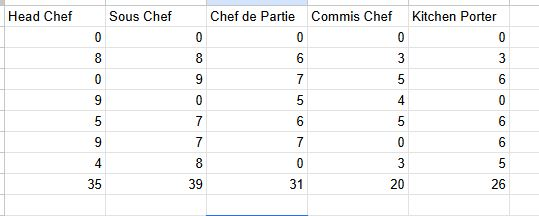
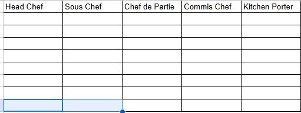

# Testing

Once the portal was operational I set about testing it for errors and to ensure any possible errors that can be made were caught.

The deployed project live link is [HERE](https://project-3-heroku-8742cd432e6c.herokuapp.com/) - **_Use Ctrl (Cmd) and click to open in a new window._**

The following tests were carried out to ensure the portal is working correctly

| **Feature** | **Action**                                                    | **Expected Result**                  | **Actual Result**                                             |
| ----------- | ------------------------------------------------------------- | ------------------------------------ | ------------------------------------------------------------- |
| Name input  | User is asked to enter their name                             | First & Last name input              | Works as expected                                             |
| Name input  | User inputs symbol or number                                  | Error message appears                | Works as expected                                             |
| Profession  | User selects their profession                                 | User types their profession in       | Works as expected                                             |
| Profession  | User selects invalid letter                                   | Error message appears                | Works as expected                                             |
| Information | User asked if they would like to look at their previous hours | if yes they see their previous hours | Works as expected                                             |
| Information | User asked if they would like to look at their previous hours | if no they continue to next part     | Works as expected                                             |
| Dates       | User adds days of the current week into the worksheet         | Correct information confirmed        | The program accepts the data but doesn't change the worksheet |

## HTML and CSS Testing
I passed the simple 404 page through both validators and they came back with no errors

## Testing Browsers

The portal was tested in the following browsers (based on my own testing and those of people who tested the portal):

- Chrome
- Edge
- Firefox
- Oprea
- Safari

It worked without issues in the above browsers.

## Testing Google Sheets

Once the Google sheets was attached and working I tested the system several times by inputting all the different jobs and receiving the correct total back in the terminal

However although the program accepts data for the 'current' worksheet it doesn't seem to change the actual table no matter what I enter. This is a bug I've yet to fix

# Certain Bugs

Some bugs I came across throughout development that were eventually fixed.

## Bug1

This bug was due to a break in the position function and was causing python trouble so I deleted it and changed it into a return which fixed the issue.

## Bug2

This Bug was causing the name input to accept characters other than letters which is what I was trying to avoid however ended up fixing evetually having the names repeat until the corrcet characters are used.

## Bug3

This bug was the result of me typing append.col instead of append.row which caused the program to break and I eventually fixed by changing that line of code.

## Future Updates

As a result of testing requests for future functionality include:

The ability to add multiple weeks to the worksheet

User can have hours emailed to them so they can keep up to date with their rota

### [BACK TO README](https://github.com/Wazza1999/Project-3/blob/main/README.md)
